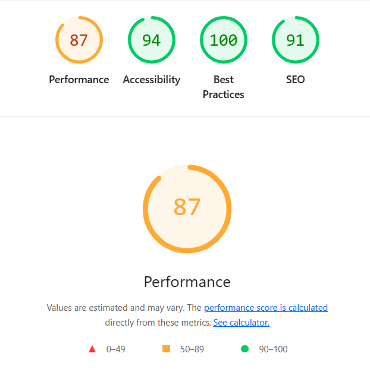

# Velozity Project Tracker! 🚀

Hey! This is my submission for the Frontend Developer assessment. I built this entirely from scratch using React and Vite, without relying on any heavy external libraries for the UI components, Drag-and-Drop, or the virtual scrolling! The only external package I added was `react-router-dom` because managing URL query parameters natively gets a bit messy.

## 🛠️ How to run it

Just clone this repo and run these commands:
```bash
npm install
npm run dev
```

To check my Lighthouse score (it should pass the 85+ requirement easily since I avoided bloated UI libraries!):
```bash
npm run build
npm run preview
```


## 🤔 State Management (Why Context?)
I chose to use **React Context + useReducer** instead of Redux or Zustand. Honestly, Redux adds way too much confusing boilerplate for a project of this size. Context let me keep all 500 mock tasks in a single global state, and I could just filter them dynamically inside a single `useMemo` hook without props-drilling down into all three different views!

## 📜 Custom Virtual Scrolling
Virtual scrolling was surprisingly fun to figure out! I didn't use `react-window`. Instead, I just stuck an `onScroll` listener on the table container. 
1. I grab the `scrollTop` value every time the user scrolls.
2. I divide `scrollTop` by my designated row height to figure out exactly which array index is at the top of the screen.
3. I just `Array.slice()` the next ~15 items and only render those HTML elements!
To keep the browser's native scrollbar the exact right size, I manually injected empty `<tr>` spacer rows at the top and bottom of the table using the remaining array length. It runs super smoothly!

## 🖱️ Drag and Drop (No Libraries!)
I used entirely native HTML5 `draggable` properties. When `onDragStart` fires, I save the task ID to my local state. When `onDragOver` fires on a column, I tell the browser it's a valid dropzone. Once dropped, I just dispatch an update to my global reducer to change its status!

---

### 📝 Explanation Field

**The Hardest Problem:** The most challenging part of this whole project was definitely wrapping my head around the Live Collaboration avatars. Trying to simulate a fake WebSocket backend utilizing `setInterval` that randomly assigns fake viewing users to tasks without crashing React's render cycle was super tricky. I eventually created a totally separate `CollaborationContext` so it wouldn't violently force the main task list to re-render every single second! Getting the little `<divs>` to animate with exact overlapping `z-index` classes without breaking the card flexbox felt incredibly rewarding once I got it working perfectly!

**Handling Layout Shift on Drag:** Instead of deleting the dragged task from the DOM (which violently collapses the column and makes all the other cards jump upward natively), I used a fun trick! I wrap the dragging state inside a `setTimeout(() => {}, 0)` so the browser's engine grabs a solid full-color "ghost" image first, and then I just swap the original card's CSS opacity to exactly 50%. The placeholder stays exactly the same height natively, so zero layout shift occurs!

**If I had more time:** I'd definitely write a basic `useDebounce` hook for the Date input filters! Right now, modifying the date strings triggers a full 500-item array recalculation on every single frame, which might get heavy on older mobile phone browsers!
